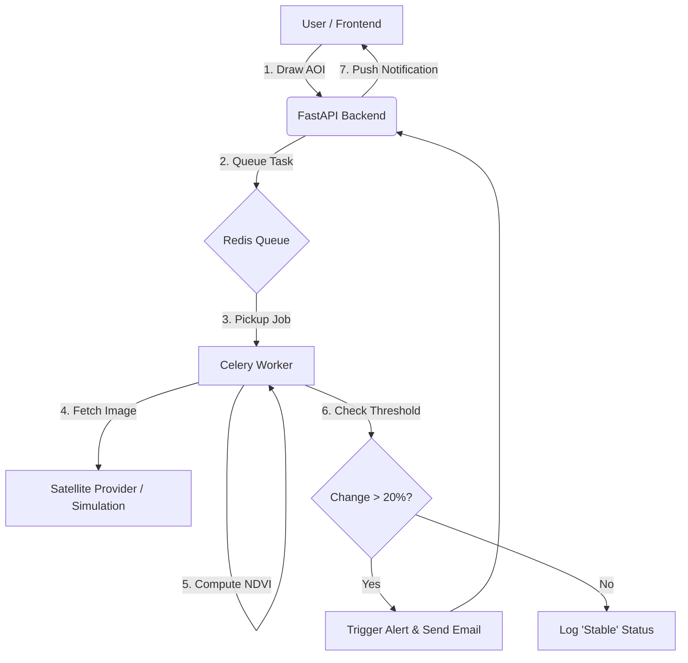

# 🛰️ WatchDog: Automated Satellite Change Detection & Alert System

> An "Eye in the Sky" that monitors forests and critical infrastructure using Sentinel-2 Satellite Imagery, NDVI Spectral Analysis, and Proactive AI Alerts.


## 📌 Problem Statement
Governments and organizations manage millions of acres of land, including forests, national parks, and defense sites. **Manual patrolling is impossible** at this scale. Illegal activities (deforestation, mining, encroachment) often go unnoticed until it is too late.

## 💡 Our Solution
We have built an **Autonomous Monitoring Pipeline** that:
1.  **Watches** user-defined Areas of Interest (AOIs).
2.  **Automatically fetches** new satellite imagery (Sentinel-2) every ~5 days.
3.  **Detects Changes** using scientific **NDVI (Normalized Difference Vegetation Index)** analysis.
4.  **Alerts Authorities** instantly via Email/SMS when significant changes (>20%) are detected.

---

## 🚀 Key Features (USPs)
*   **📡 Multi-Temporal Analysis**: Compares historical vs. current satellite data to find true changes.
*   **🧠 Intelligent Filtering**: Uses Cloud Masking and Thresholding to ignore weather noise and seasonal variations.
*   **⚡ High-Performance Architecture**: 
    *   **Frontend**: Built with **Vue 3 + Vite + TailwindCSS** for a premium, responsive experience.
    *   **Backend**: Powered by **FastAPI (Python)** for high-speed async processing.
    *   **Processing**: Integrated **Celery + Redis** for background task management.
*   **📧 Proactive Alerting**: System notifies YOU; you don't have to check the map daily.

---

## 🛠️ Technology Stack
| Component | Technology | Use Case |
| :--- | :--- | :--- |
| **Frontend** | Vue 3, Vite, TailwindCSS | Interactive Dashboard & Map UI |
| **Mapping** | OpenLayers (OL) | Rendering Satellite Maps & AOI Drawing |
| **Backend** | Python (FastAPI) | High-performance REST API |
| **Core Logic** | NumPy, Rasterio, GeoPandas | Satellite Image Processing & NDVI Math |
| **Async Tasks** | Celery + Redis | Handling heavy image processing jobs |
| **Data Source** | Sentinel-2 (ESA) | Publicly available satellite imagery |

---

## 🏗️ System Architecture


---

## 💻 Installation & Setup

### Prerequisites
*   Python 3.9+
*   Node.js 16+
*   Redis (Optional, for full async mode)

### 1️⃣ Backend Setup
```bash
cd backend
python -m venv venv
# Windows:
venv\Scripts\activate
# Linux/Mac:
source venv/bin/activate

pip install -r requirements.txt
uvicorn main:app --reload
```
*Backend runs at: `http://localhost:8000`*

### 2️⃣ Frontend Setup
```bash
cd frontend
npm install
npm run dev
```
*Frontend runs at: `http://localhost:5173`*

---

## 🎮 How to Run the Demo
1.  Open the **Frontend Dashboard**.
2.  Click **"New AOI"** on the sidebar.
3.  **Draw a Polygon** on the map (Click points, Double-click to finish).
4.  The system will automatically trigger a **Simulation**.
5.  Wait for the **Red Alert Banner** to appear: *"Significant vegetation loss detected"*.
6.  Observe the **"📧 Email Sent"** confirmation badge.

---

## ❓ FAQ (Defense Guide)

**Q: Do you use real-time data?**
A: The system is designed to use the **Sentinel-2 Public API**. For this demonstration, we use a **Simulation Mode** to show the end-to-end pipeline without waiting for large file downloads.

**Q: Why NDVI instead of Deep Learning?**
A: NDVI is computationally efficient, scientifically proven for vegetation analysis, and offers transparent "Explainable AI" results, which is crucial for government auditing.

**Q: Can this scale?**
A: Yes. We use **Celery & Redis**, which allows us to add hundreds of worker nodes to process thousands of AOIs in parallel.

---

## 📜 License
MIT License. Built for Innovation.
